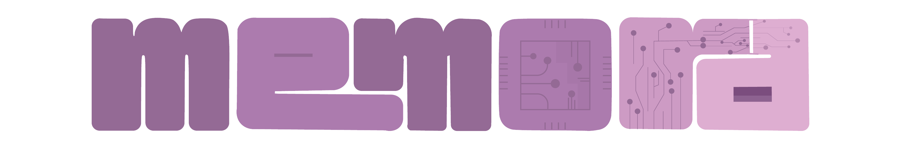

   
  <h1>MEMORA</h1>
  <strong>Welcome to Memora, an innovative learning platform featuring flashcard-based learning!</strong> &nbsp; 

 

  

 
 

## 💾 What is Memora?
<strong>Memora</strong> It's an innovative learning platform featuring flashcard-based learning with a Spaced Repetition System (SRS), customizable Pomodoro timers, rich text note-taking, and comprehensive progress tracking. Designed structured role management for learners, educators, parents, moderators, and administrators to foster personalized, efficient, and collaborative learning experiences.
 
<strong>Check out all the details here-> </strong> <a href="https://drive.google.com/file/d/1n9zx4GdkFjR1EHNrDRCTI042flsKLEqC/view?usp=drive_link">Report Link</a>
 
 
